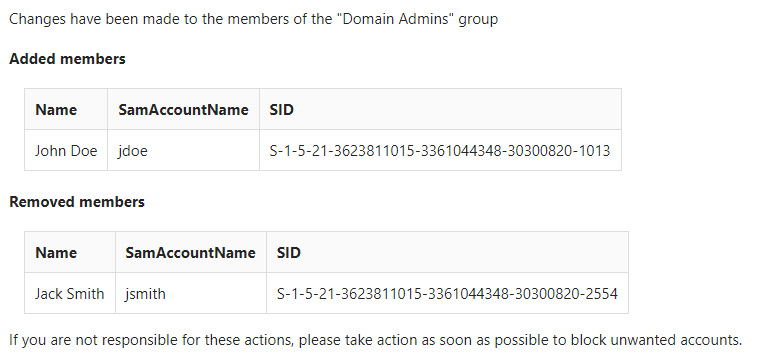

# DomainAdminsAlert

This script is used to monitor changes in the members of the "Domain Admins" group in an Active Directory environment. It compares the current members of the group with a reference list stored in a CSV file and sends an email notification if there are any changes. The email includes a list of added and removed members, if any.

The best use of this PowerShell code is to place it in a scheduled task, executed very frequently.

The script accepts several parameters:

- `-UpdateList`: If this switch is present, the script will update the reference CSV file with the current members of the group and exit.
- `-IgnoreRemoveMember`: If this switch is present, the script will ignore removed members when comparing the reference list with the current members.
- `-To`: An array of email addresses to send the notification to. The default value is <email@domain.co>.
- `-Cc`: An array of email addresses to CC on the notification email.

Preview of an email:

